# Project Overview
This project implements a modular deep learning framework for time series forecasting, anomaly detection, and representation learning. The primary focus is on stock time series, utilizing LSTM and convolutional autoencoder architectures for robust, scalable analysis. All code is provided as Python scripts and Jupyter notebooks for reproducibility and extensibility.

# Development Environment
Development was performed in Google Collaboratory using Python notebooks. The source code is also provided as .py files for command-line execution.

This repository was developed in cooperation with the kondim/repository project, which was used to verify and validate some of the results produced here, particularly for high-dimensional search and clustering tasks using the compressed time series representations.

# How to Run
The main scripts can be executed as follows:
```bash
python3 forecast.py -d <dataset path> -n <number of time series selected> -t <offline_all|online_all|online_self>
python3 detect.py -d <dataset path> -n <number of time series selected> -t <offline_all|online_all> -mae <error value as double>
python3 reduce.py -d <dataset> -q <queryset> -od <output_dataset_file> -oq <output_query_file> -t <offline_all|online_all>
```
- `-t offline_all`: Use a pre-trained model for all time series
- `-t online_all`: Train on all time series during execution
- `-t online_self`: Train per time series during execution

The directory structure must remain unchanged for successful execution. Some TensorFlow warnings may appear but do not affect results.

# Experimental Methodology
## Time Series Forecasting
Experiments were conducted with various hyperparameters. The optimal number of epochs was selected to minimize loss before overfitting, as determined by training and validation loss plots.

### Examples of Good Forecasting Results
The following images show examples of time series forecasting where the model predictions closely match the actual values, demonstrating strong model performance:

| 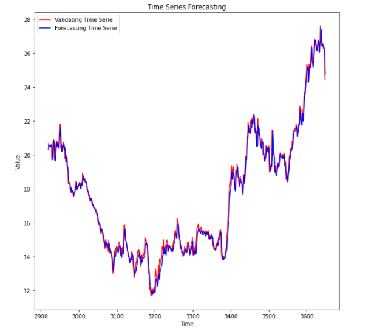 | 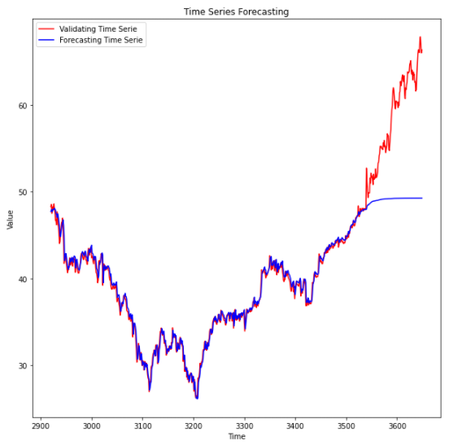 |
|:-------------------------------------------------------:|:-------------------------------------------------------:|
| 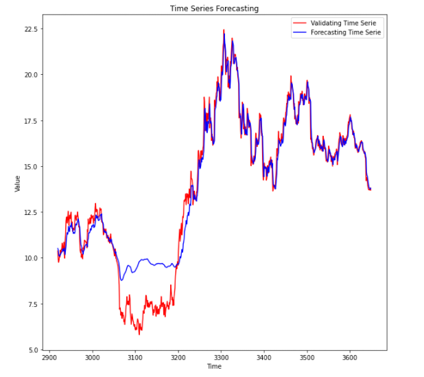 | 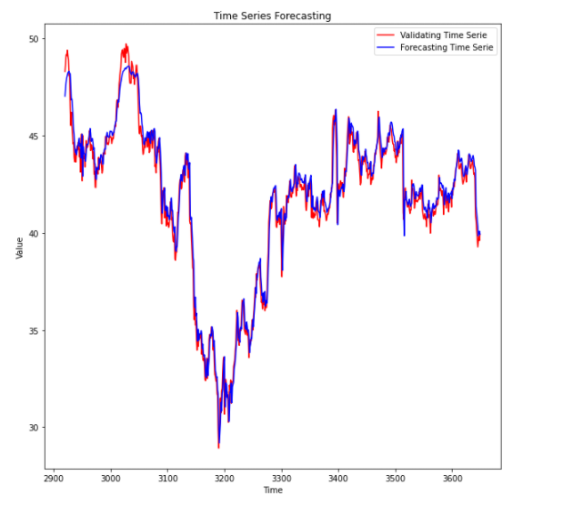 |

*Figure: Examples of accurate time series forecasting results (blue: forecast, red: actual).* 

| Experiment | Batch Size | Layers | Units/Layer | Time Steps | Train Loss   | Val Loss   |
|------------|------------|--------|-------------|------------|-------------|------------|
| 1          | 32         | 4      | 32          | 50         | 8.3730e-04  | 0.0807     |
| 2          | 32         | 4      | 64          | 60         | 5.3747e-04  | 0.0847     |
| 3          | 32         | 4      | 128         | 50         | 5.7512e-04  | 0.0919     |
| 4          | 64         | 6      | 64          | 60         | 5.6178e-04  | 0.0865     |
| 5          | 64         | 6      | 128         | 50         | 5.5015e-04  | 0.0909     |
| 6          | 64         | 6      | 32          | 60         | 8.6226e-04  | 0.0900     |
| 7          | 64         | 8      | 64          | 50         | 5.7873e-04  | 0.0828     |
| 8          | 128        | 8      | 128         | 60         | 4.4686e-04  | 0.0857     |
| 9          | 128        | 6      | 64          | 50         | 5.7284e-04  | 0.0855     |

- Each layer consists of an LSTM and a dropout layer (dropout rate 0.2) to prevent overfitting.
- Execution time decreases with larger batch sizes, but very large batch sizes (>1024) do not further reduce loss.
- Increasing the number of hidden layers does not always reduce loss; the problem does not require more complex models than those tested.
- More units per layer significantly reduce loss.
- The time-steps (look-back) hyperparameter has little effect on loss.
- The best model uses the hyperparameters from experiment 8.

## Time Series Anomaly Detection
The same approach was used for anomaly detection. The experiments are summarized below:

### Examples of Good Anomaly Detection Results
The following images show examples where the model successfully detected anomalies in the time series:

| 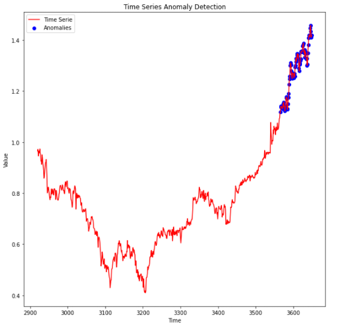 | 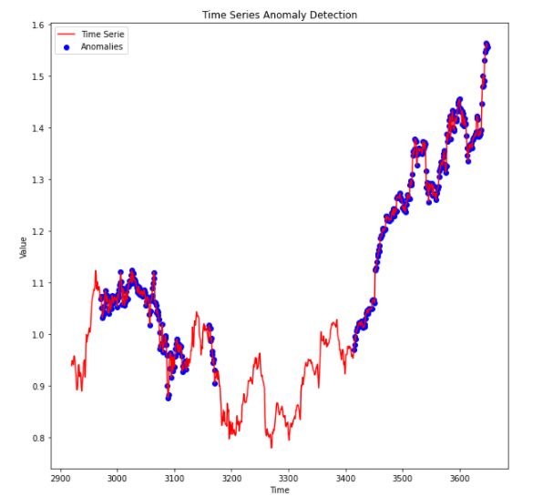 |
|:------------------------------------------------------:|:------------------------------------------------------:|
| 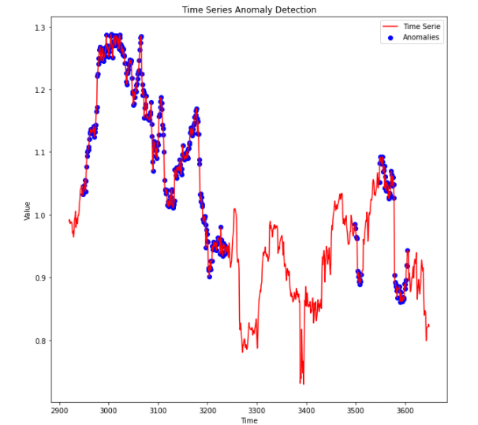 | 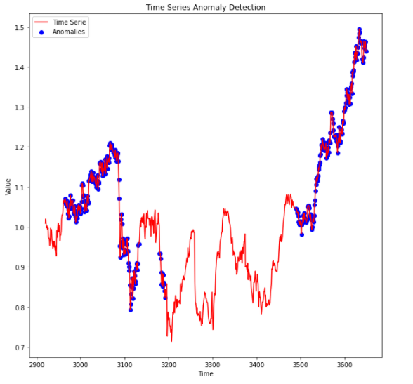 |

*Figure: Examples of accurate anomaly detection (red: time series, blue: detected anomalies).* 

| Experiment | Batch Size | Layers | Units | Time Steps | Train Loss | Val Loss |
|------------|------------|--------|-------|------------|------------|----------|
| 1          | 32         | 2      | 64    | 50         | 0.2111     | 0.6069   |
| 2          | 32         | 2      | 128   | 60         | 0.2120     | 0.6148   |
| 3          | 32         | 2      | 256   | 50         | 0.2110     | 0.6074   |
| 4          | 64         | 2      | 64    | 60         | 0.2143     | 0.6132   |
| 5          | 64         | 4      | 128   | 50         | 0.2112     | 0.6121   |
| 6          | 128        | 6      | 64    | 60         | 0.1987     | 0.6241   |
| 7          | 128        | 6      | 128   | 50         | 0.1998     | 0.6218   |
| 8          | 128        | 6      | 32    | 60         | 0.1975     | 0.6243   |

- Each layer consists of an LSTM and a dropout layer (dropout rate 0.2).
- Execution time decreases with larger batch sizes, but very large batch sizes (>1024) do not further reduce loss.
- More hidden layers significantly reduce loss; the problem requires a fairly complex model.
- The number of units per layer has little effect on loss.
- The time-steps (look-back) hyperparameter has little effect on loss.
- The best model uses the hyperparameters from experiment 8.

## Convolutional Autoencoding of Time Series
The same methodology was applied for convolutional autoencoding. The experiments are summarized below:

### Examples of Good Compression Results
The following images show examples where the model achieved high-quality compression and reconstruction of time series:

| 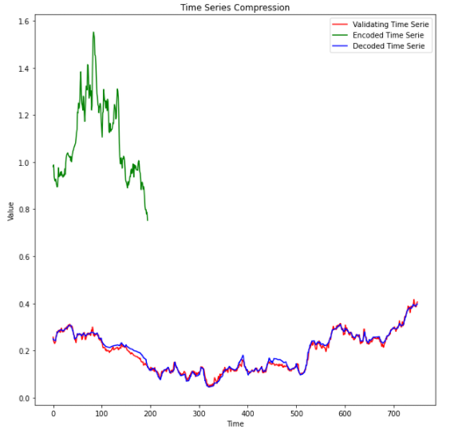 | 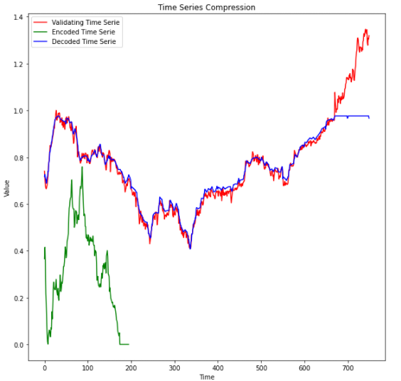 |
|:-----------------------------------------------:|:-----------------------------------------------:|
| 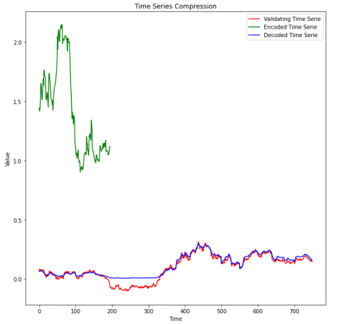 | 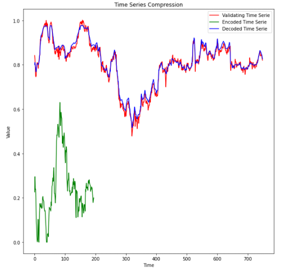 |

*Figure: Examples of effective time series compression and reconstruction (red: original, green: encoded, blue: decoded).* 

| Experiment | Batch Size | Layers | Filter Size | Window Length | Latent Dimension | Train Loss | Val Loss |
|------------|------------|--------|-------------|--------------|------------------|------------|----------|
| 1          | 32         | 2      | 16          | 10           | 3                | 0.6791     | 0.7576   |
| 2          | 32         | 2      | 16          | 50           | 13               | 0.5563     | 0.2912   |
| 3          | 32         | 2      | 32          | 50           | 13               | 0.5303     | -0.1815  |
| 4          | 32         | 3      | 16          | 50           | 7                | 0.5317     | -0.5217  |
| 5          | 567        | 3      | 16          | 10           | 2                | 0.5436     | -0.9232  |
| 6          | 64         | 3      | 32          | 50           | 7                | 0.5304     | -0.8348  |
| 7          | 64         | 3      | 64          | 10           | 2                | 0.5295     | -0.2726  |
| 8          | 32         | 4      | 16          | 50           | 4                | 0.5307     | -0.1027  |
| 9          | 32         | 4      | 32          | 50           | 4                | 0.6665     | -0.8822  |

- Each layer consists of a conv1d and a dimension upsampling/downsampling layer. For layers=3, this means 3 downsampling (conv1d and maxpooling1d) and 3 upsampling (conv1d and upsampling) layers.
- Execution time decreases with larger batch sizes, but very large batch sizes (>1024) do not further reduce loss.
- Significant increase or decrease in the number of layers prevents loss minimization.
- The number of units per layer has little effect on loss.
- The time-steps (look-back) hyperparameter has little effect on loss.
- The best model uses the hyperparameters from experiment 4.

The compressed time series produced were injected into the search and clustering suite for high-dimensional vectors and curves in the `kondim/repository` project. This allowed for effective nearest neighbor search and clustering, with similar centroids and neighbors being found, demonstrating the quality and utility of the learned representations for downstream tasks.

# Key Observations
- LSTM models are effective for both forecasting and anomaly detection in time series.
- Convolutional autoencoders enable dimensionality reduction and facilitate downstream tasks.
- Hyperparameter tuning and regularization are critical for robust performance.
- Limitations include sensitivity to data quality and the need for careful threshold selection in anomaly detection.

# Conclusion
This project demonstrates the effectiveness of deep learning for time series analysis. The provided framework is extensible and can be adapted to other domains or enhanced with advanced architectures such as attention mechanisms or transformers. Future work may include automated hyperparameter optimization and model explainability.